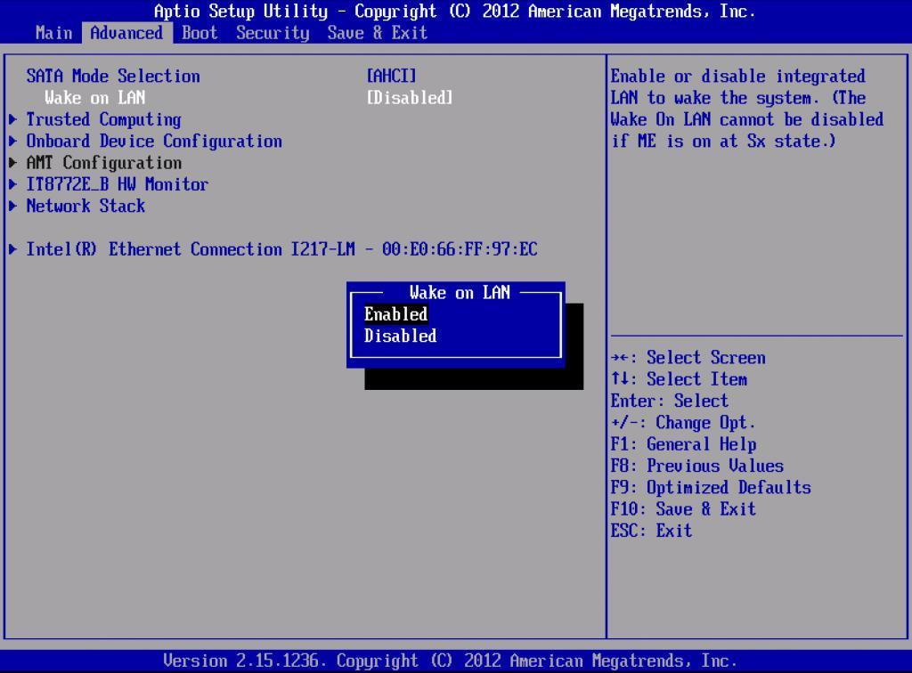
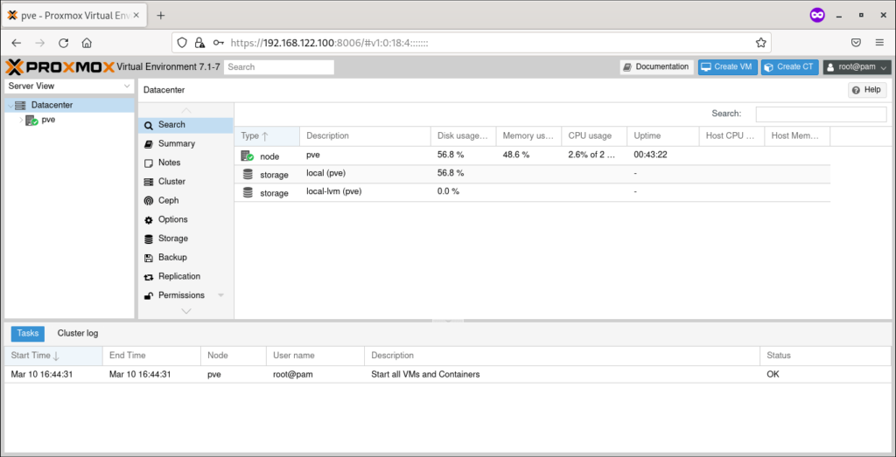
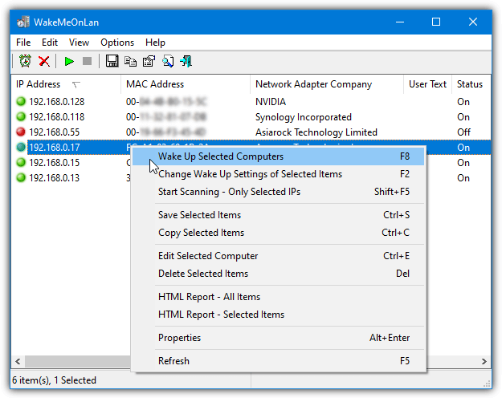

# Proxmox Home Lab – Wake-on-LAN Access da remoto

Questo report nasce dalla mia esigenza di creare un piccolo laboratorio casalingo stabile, gestibile da remoto, senza dover tenere acceso un PC 24 ore su 24. La macchina è collocata in garage, senza monitor né tastiera: faccio tutto in remoto da altri dispositivi. Il sistema è stato configurato per accendersi tramite Wake-on-LAN e per essere gestito via browser attraverso Proxmox.

---

## 1. Specifiche hardware

La macchina su cui ho installato Proxmox è un vecchio workstation server riciclato per fare da hypervisor:

- **CPU:** Intel Xeon E5-2695 v3 (14 core / 28 thread)
- **RAM:** 32GB DDR4
- **Disco:** SSD da 512GB
- **Scheda di rete:** Intel con supporto WOL
- **Nome host:** `lab-proxmox`
- **Posizione:** garage, collegato via cavo al router

---

## 2. Installazione Proxmox

1. Ho scaricato l'immagine ISO dal sito ufficiale di Proxmox.
2. L'ho scritta su una chiavetta USB usando **Balena Etcher**.
3. Avvio da USB, installazione su SSD interna, configurazione standard.
4. Durante l’installazione ho assegnato un IP statico: `192.168.1.150`.
5. Dopo il riavvio, accedo da browser con:

```
https://192.168.1.150:8006
```

*(browser Chrome, accettato certificato non valido)*

---

## 3. Configurazione del Wake-on-LAN

Per accendere la macchina da remoto:

- Entrato nel BIOS e abilitato WOL (Wake on PCI-E).
- Da terminale, su Proxmox ho verificato:

```bash
ethtool eno1 | grep Wake-on
```

- Risultato: `Wake-on: g`
- MAC address annotato: `00:11:22:33:44:55`

---

## 4. WakeMeOnLan da Windows

Per avviare la macchina da Windows:

1. Ho scaricato **WakeMeOnLan** da Nirsoft.
2. Aggiunto manualmente la voce con:
   - IP: `192.168.1.150`
   - MAC: `00:11:22:33:44:55`
   - Nome: `lab-proxmox`
3. Quando serve accendere la macchina, clicco col tasto destro → “Wake Up Selected Computers”

Funziona perfettamente.

---

## 5. Accesso remoto esterno

Per ora l’accesso da fuori casa è in test, ma ho predisposto così:

- **Port forwarding** sul router Iliad (porta 8006 verso IP 192.168.1.150)
- **DNS dinamico** non ancora configurato
- In futuro valuterò **Tailscale** per una VPN semplice e sicura

---

## 6. Immagini (dal web)

### Screenshot BIOS con WOL attivo


### Interfaccia Web Proxmox


### App WakeMeOnLan configurata


---

## 7. Considerazioni finali

Questo setup è il primo passo del mio laboratorio domestico per testare virtualizzazione, networking e strumenti di sicurezza. L’obiettivo è costruire un ambiente stabile e accessibile per fare pratica senza dipendere da risorse cloud o dispositivi attivi 24/7. In futuro potrei aggiungere anche server virtuali, firewall e SIEM.

---

## 8. Info personali

Creato da Sebastiano Daniele Condorelli  
LinkedIn: www.linkedin.com/in/sebastianodanielecondorelli 

2025
